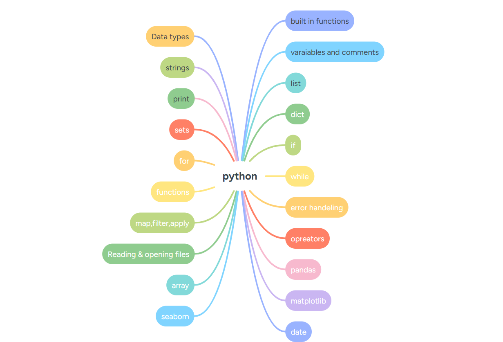

# 🐍 Python for Data Analysis - Course Materials

This repository contains a full set of Jupyter Notebooks designed to teach Python for beginners focusing on data analysis.

## 📘 Topics Covered

The course is structured as notebooks per topic:

- Data Types, Strings, Lists, Sets, Dictionaries
- Print, Variables, Comments, Built-in Functions
- Control Flow: if, for, while, functions
- Functional Programming: map, filter, apply, lambda
- File Reading and Writing
- Arrays and NumPy
- Pandas for data handling
- Matplotlib for visualization
- Seaborn for advanced charts
- Date & Time operations

## 🧠 Mind Map Overview

This diagram gives you a visual summary of all the topics included:

## 📁 Folder Contents

Each `.ipynb` file corresponds to a topic.
You can run them individually in JupyterLab or VS Code.

---

Feel free to clone and explore the notebooks interactively!  
PRs and suggestions are welcome 🤝
